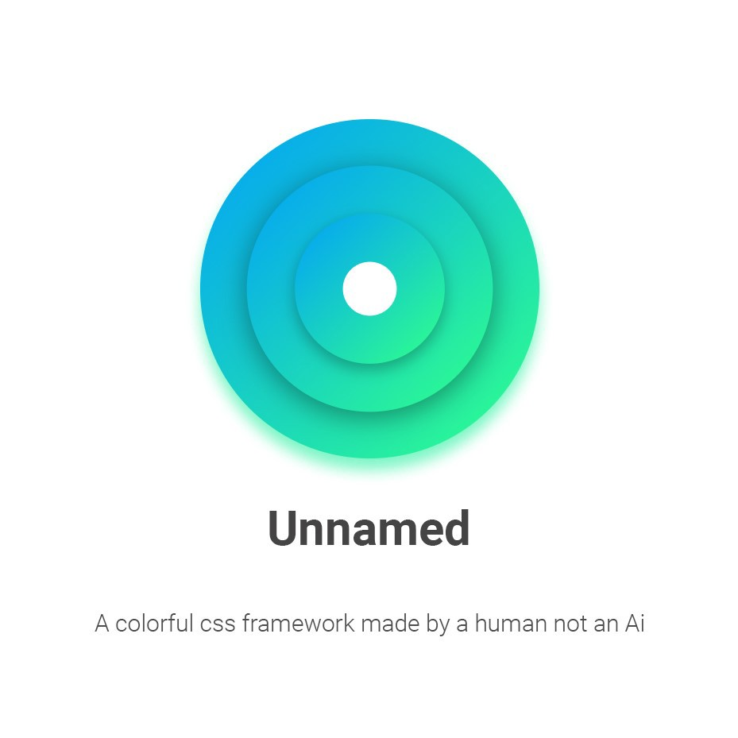

I hate when I use a known css framework like Skeleton or Bulma… and specially frameworks like Bootstrap or Foundation…

Because of many reasons but here’s the main reason: “since I’m also an UI designer, I always have to rewrite the entire css code of the UI elements like buttons, forms, cards…”.

So I started going deep in css, like the trick to style a radio or checkbox button (hiding the input and styling the span tag), learned a lot about flexbox, about the standard way to make a grid system (floats & widths), flexbox grids & also cssgrid & a lot more…, and so I started posting pens of each styled element on my [codepen](https://codepen.io/smakosh) until one day I was designing an UI kit at 2 am — lol — and I thought about coding each element & that’s when I started coding the framework, I didn’t think about sharing it or open sourcing it but then I thought why not? some would love to use it too right? & so, I published it, made it open source & included everything on the github repository for the front end developers who would love to edit everything.

Unnamed is easy to use & to edit!, there is also a npm module 

    $ nmp i unnamed

& import it if you're using webpack

    import 'unnamed'

There is also a CDN if you're not used to the node eco-system

    https://unpkg.com/unnamed

I got a positive & negative feedback on Product hunt that really made me go forward and make more useful products so expect more soon!

Docs: https://unnamed.smakosh.com

On github: https://github.com/smakosh/unnamed-css-framework